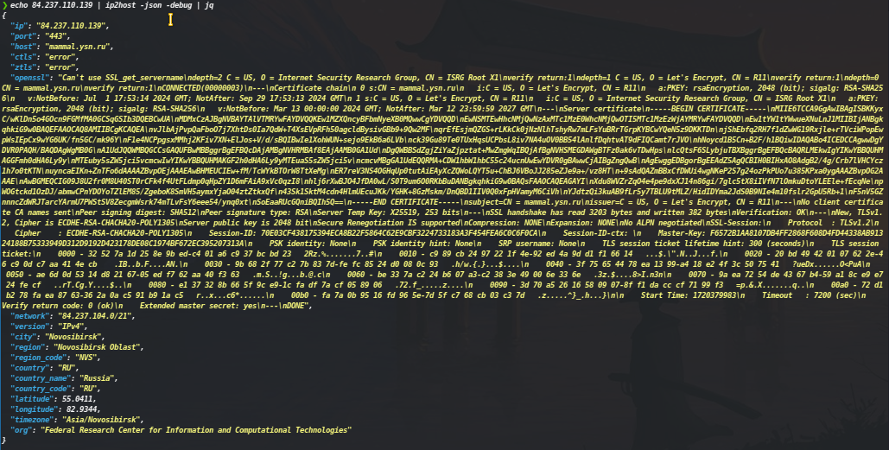

# ip2host IP Host and Geo-Information Checker

This tool performs TLS connections to specified IP addresses, retrieves host information, and optionally gathers detailed IP information using the `ipapi.co` API.



## Features

- Retrieve host information from IP addresses with specified ports.
- Optionally gather geo-information and detailed IP data using `ipapi.co` API.
- Output results in plain text or JSON format.
- Customize connection timeout and retry attempts.
- Debug mode for extended output including command results and geo-information.

## Installation

You can install this tool directly using Go:

```sh
go install -a -v github.com/pikpikcu/ip2host@latest
```
## Usage
```sh
ip2host -h
Usage of ip2host:
  -debug
        Enable debug output
  -json
        Output in JSON format
  -o string
        Output file
  -retry int
        Number of retries to perform for failures (default 3)
  -timeout int
        TLS connection timeout in seconds (default 5)
```
## Examples
Basic usage with default settings:
```sh
cat ips.txt | ip2host
```
Output results in JSON format:
```sh
cat ips.txt | ip2host -json
```
Enable debug mode for extended output:
```sh
cat ips.txt | ip2host -debug
```
## Input Format
The input should be a list of IP addresses, one per line. You can also specify a custom port for each IP address using the format IP:Port. If no port is specified, the default port 443 is used.

Example
```txt
cat ips.txt

127.0.0.1
192.168.1.1:8443
```
